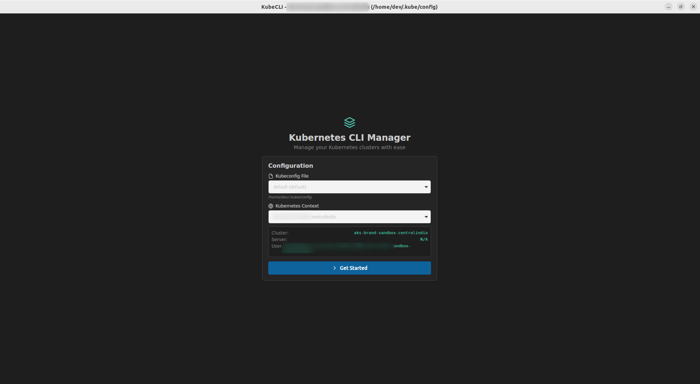
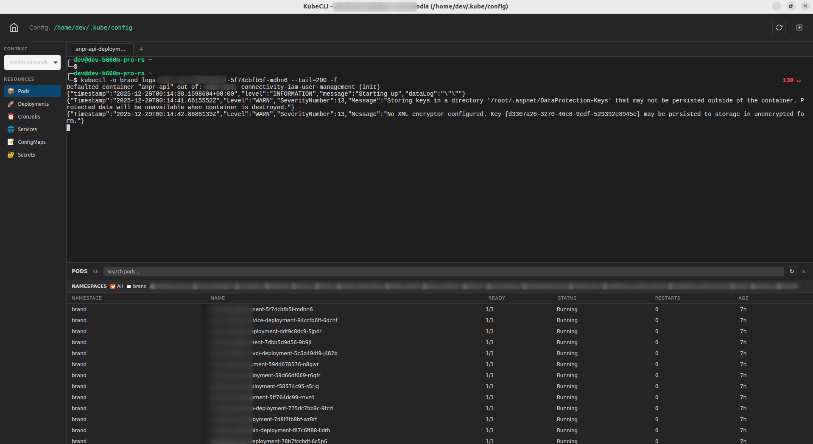

# KubeCLI

A desktop application for managing Kubernetes contexts and running kubectl commands with an intuitive UI.

## Screenshots

### Home Screen


### Terminal View


## Features

### Configuration Management
- **Kubeconfig File Switching**: Seamlessly switch between multiple kubeconfig files
- **Context Management**: View and switch between kubeconfig contexts with real-time updates
- **Namespace Selection**: Quick namespace switching for targeted resource operations

### User Interface
- **Command Palette**: Quick action access via Ctrl+Shift+P keyboard shortcut
- **Slim Sidebar**: Compact context selector with minimal footprint
- **Resizable Bottom Panel**: Searchable resource panel with inline and context menu actions
- **Auto-refresh**: Automatic UI updates when switching panels or performing actions

### Terminal & Tabs
- **Embedded Terminal**: Full-featured PTY terminal powered by xterm.js
- **Multi-Window Support**: Open multiple application windows for different kubeconfig files simultaneously
- **Per-Context Terminals**: Create multiple terminal sessions for each context within a kubeconfig file
- **Multi-Resource Tabs**: Open multiple terminals per resource with intelligent duplicate detection
- **Isolated Sessions**: Each window maintains independent context, namespace, and terminal state
- **Tab Navigation**: Keyboard shortcuts for efficient tab management
  - Ctrl+Tab / Ctrl+Shift+Tab: Navigate between tabs
  - Ctrl+T: New tab
  - Ctrl+W: Close current tab

### Resource Management
- **Quick Actions**: Context-specific actions for Kubernetes resources
  - **Pods**: Logs, describe, exec, port-forward, delete
  - **Deployments**: Describe, scale, logs, delete
  - **Services**: Describe, port-forward, delete
  - **CronJobs**: Describe, trigger job, delete
- **Resource Filtering**: Real-time search and filtering in bottom panel
- **Favorite Actions**: Pin frequently-used actions for quick access

## Prerequisites

- **Node.js**: LTS version (18 or 20)
- **Rust**: Latest stable (for Tauri)
- **kubectl**: Installed and accessible in PATH
- **Kubeconfig**: Valid configuration at `~/.kube/config` or `$KUBECONFIG`

## Installation

```bash
npm install
```

## Development

```bash
npm run dev
```

## Build

```bash
sudo apt install librsvg2-dev
npm run build
```

## Tech Stack

- Tauri 2.x (Rust backend)
- React 19 + TypeScript
- Vite
- xterm.js + portable-pty

## License

MIT
