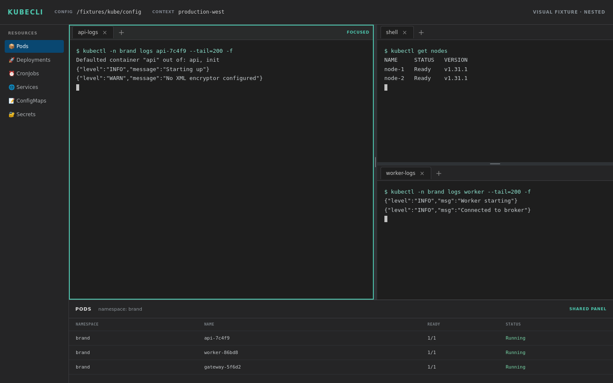

# KubeCLI

A desktop application for managing Kubernetes contexts and running kubectl commands with an intuitive UI.

## Screenshots

### Home Screen


### Terminal View


### Terminal Pane Workspace


## Features

### Configuration Management
- **Kubeconfig File Switching**: Seamlessly switch between multiple kubeconfig files
- **Context Management**: View and switch between kubeconfig contexts with real-time updates
- **Namespace Selection**: Quick namespace switching for targeted resource operations

### User Interface
- **Command Palette**: Quick action access via Ctrl+Shift+P keyboard shortcut
- **Slim Sidebar**: Compact context selector with minimal footprint
- **Resizable Bottom Panel**: Searchable resource panel with inline and context menu actions
- **Auto-refresh**: Automatic UI updates when switching panels or performing actions

### Terminal & Tabs
- **Embedded Terminal**: Full-featured PTY terminal powered by xterm.js
- **Pane Workspaces**: Right-click a pane to split right/down, zoom or restore it, or close it
- **Resizable Splits**: Drag the 8px divider between panes; horizontal and vertical splits enforce minimum sizes
- **Unified Terminal Menu**: Terminal right-click keeps Copy, Paste, and Clear Selection above the pane actions
- **Multi-Window Support**: Open multiple application windows for different kubeconfig files simultaneously
- **Per-Context Terminals**: Create multiple terminal sessions for each context within a kubeconfig file
- **Pane-Local Tabs**: Each pane owns its tabs, active terminal, and command target; split terminals reuse one bottom-panel state while independently added tabs remain isolated
- **Isolated Sessions**: Each window maintains independent context, namespace, and terminal state
- **Tab Navigation**: Keyboard shortcuts operate only on the focused pane
  - Ctrl/Cmd+Tab or Ctrl/Cmd+Shift+Tab: Navigate between local tabs
  - Ctrl/Cmd+T: New local tab
  - Ctrl/Cmd+W: Close the current local tab

Zooming hides sibling panes without unmounting their terminals, so restoring returns to the same layout and divider ratios. The final pane cannot be closed.

### Resource Management
- **Quick Actions**: Context-specific actions for Kubernetes resources
  - **Pods**: Logs, describe, exec, port-forward, delete
  - **Deployments**: Describe, scale, logs, delete
  - **Services**: Describe, port-forward, delete
  - **CronJobs**: Describe, trigger job, delete
- **Resource Filtering**: Real-time search and filtering in bottom panel
- **Favorite Actions**: Pin frequently-used actions for quick access

## Prerequisites

- **Node.js**: LTS version (18 or 20)
- **Rust**: Latest stable (for Tauri)
- **kubectl**: Installed and accessible in PATH
- **Kubeconfig**: Valid configuration at `~/.kube/config` or `$KUBECONFIG`

## Installation

```bash
npm install
```

## Development

```bash
npm run dev
```

### Refreshing pane workspace screenshots

The visual fixture imports the real pane components but uses only the public fake dataset in `src/test/fixtures/paneWorkspace.ts`. It does not start a shell, contact Kubernetes, or call Tauri, auth, timers, or network APIs.

1. Run `npm run dev:frontend`.
2. Open `http://127.0.0.1:5174/pane-workspace-fixture.html?case=nested` in a browser configured to 1440×900, device scale factor 1, dark color scheme, and reduced motion.
3. Capture these query cases into `docs/screenshots/`: `nested`, `split-right`, `split-down`, `resized`, `restored`, and `min-size`.
4. For `case=menu`, right-click the shell pane before capturing. For `case=zoomed`, right-click the zoomed shell pane so the baseline records the **Restore Pane** action.
5. Freeze the clock at `2026-08-17T09:30:00.000Z`, wait for fonts plus two animation frames, and keep the PNG names in the form `pane-workspace-<case>.png`.

Only refresh these baselines for intentional visual changes. Run `npm run test:run`, `npm run typecheck`, and `npm run build:frontend` afterward.

## Build

```bash
sudo apt install librsvg2-dev
npm run build
```

## Tech Stack

- Tauri 2.x (Rust backend)
- React 19 + TypeScript
- Vite
- xterm.js + portable-pty

## License

MIT
